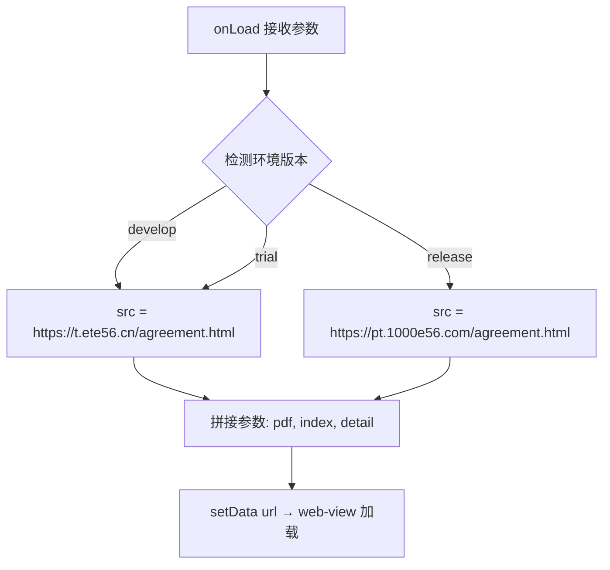
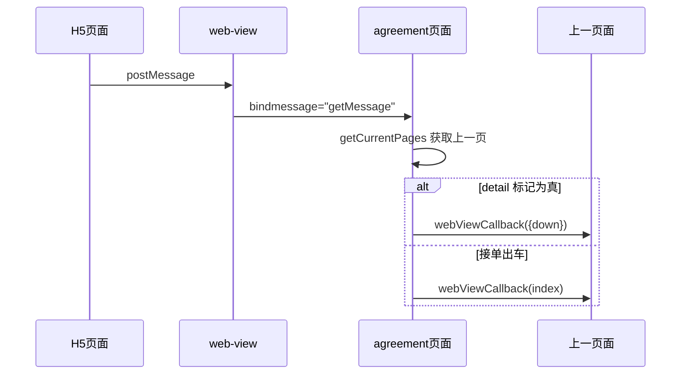

# 协议查看页（agreement）技术文档

## 1. 页面概述

协议查看页是一个纯 WebView 容器页面，用于加载和展示 PDF 协议的 H5 页面。页面内嵌 `<web-view>` 组件，通过 H5 与小程序之间的 `bindmessage` 通信机制实现交互。

- **页面路径**：`pages/agreement/agreement`
- **涉及文件**：`agreement.js` / `agreement.wxml` / `agreement.wxss` / `agreement.json`

---

## 2. 数据状态

| 字段 | 类型 | 说明 |
|------|------|------|
| `url` | String | WebView 加载的 H5 地址（含参数） |

---

## 3. 生命周期

### 3.1 onLoad

```
onLoad({ url, index, detail })
```

**流程**：



**参数说明**：

| 参数 | 说明 |
|------|------|
| `url` | PDF 文件的路径 |
| `index` | 接单任务列表的下标索引 |
| `detail` | 是否查看协议详情标记 |

**环境选择**：通过 `__wxConfig.envVersion` 判断运行环境，开发版/体验版走测试域名 `t.ete56.cn`，正式版走生产域名 `pt.1000e56.com`。

---

## 4. 核心方法

### 4.1 getMessage - WebView 消息回调



**关键逻辑**：
- 通过 `getCurrentPages()` 获取页面栈，取上一页 (`pages[pages.length - 2]`)
- 根据 H5 传回的 `data.detail` 判断回调类型：
  - `detail` 存在 → 返回协议详情（含下载标记）
  - `detail` 不存在 → 返回任务列表下标（接单出车）

---

## 5. API 接口

本页面无独立的后端 API 调用，所有交互通过 WebView 内的 H5 页面完成。

---

## 6. 注意事项

1. **域名校验**：`web-view` 加载的域名需在后台配置业务域名白名单
2. **通信机制**：小程序与 H5 通过 `wx.miniProgram.postMessage` / `bindmessage` 通信，数据在特定时机（页面后退、组件销毁、分享）才会传递
3. **环境隔离**：开发/体验环境共用测试域名，生产环境独立域名
