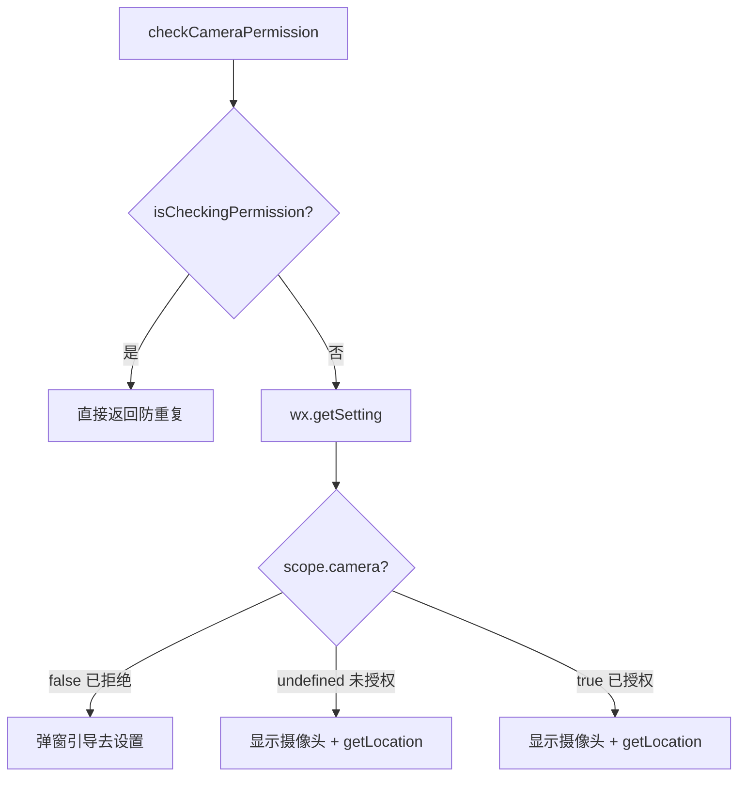
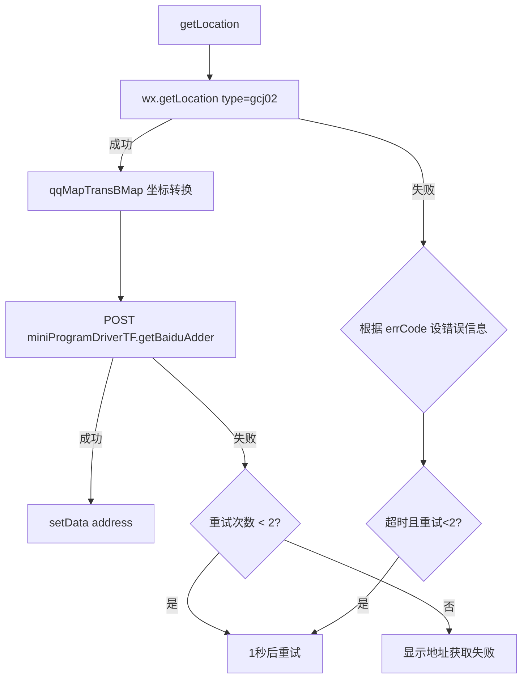
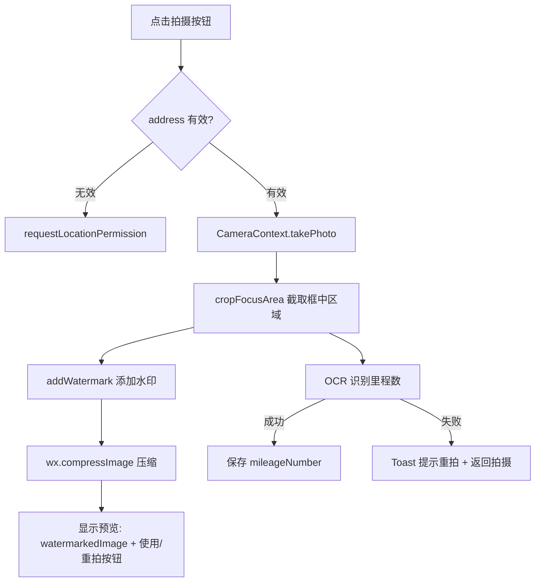

# 拍照水印页（camera）技术文档

## 1. 页面概述

拍照水印页是一个功能丰富的自定义相机页面，用于拍摄车辆里程表照片并自动添加水印（时间、日期、位置、Logo），同时自动截取框中区域进行 OCR 里程数识别。

- **页面路径**：`pages/camera/camera`
- **涉及文件**：`camera.js` / `camera.wxml` / `camera.wxss` / `camera.json`
- **代码规模**：JS 761 行（主包中最大的单文件）

---

## 2. 数据状态

| 字段 | 类型 | 说明 |
|------|------|------|
| `device` | String | 摄像头方向：`'back'`(后置) / `'front'`(前置) |
| `flash` | String | 闪光灯：`'torch'`(开) / `'off'`(关) |
| `date` | String | 当前日期 (YYYY-MM-DD) |
| `time` | String | 当前时间 (HH:mm) |
| `timeDigits` | Array | 时间字符数组（用于水印逐个数字渲染） |
| `week` | String | 星期（如 "星期一"） |
| `address` | String | 定位地址文本 |
| `cameraWidth` | Number | 摄像头预览区域宽度 |
| `cameraHeight` | Number | 摄像头预览区域高度 |
| `canvasWidth` | Number | Canvas 画布宽度（拍照图片原始宽） |
| `canvasHeight` | Number | Canvas 画布高度（拍照图片原始高） |
| `tempImagePath` | String | 拍照后的临时图片路径 |
| `showPreview` | Boolean | 是否显示预览模式 |
| `watermarkedImage` | String | 添加水印后的图片路径 |
| `showWatermark` | Boolean | 是否显示取景框和水印叠加层 |
| `imageMode` | String | 预览图片显示模式 |
| `locationRetryCount` | Number | 定位失败重试计数（最多 2 次） |
| `cameraAuthorized` | Boolean | 摄像头是否已授权 |
| `isCheckingPermission` | Boolean | 是否正在检查权限（防重复） |
| `showCamera` | Boolean | 是否显示摄像头组件 |
| `systemScreenWidth` | Number | 屏幕宽度（用于缩放计算） |

---

## 3. 生命周期

### 3.1 onLoad

1. 调用 `formatTime()` 获取当前日期、时间、星期
2. 启动 60 秒间隔的定时器 `getTime()` 更新时间
3. 调用 `checkCameraPermission()` 检查摄像头权限

### 3.2 onReady

- 获取系统信息 `wx.getSystemInfoSync()`
- 计算摄像头预览区域尺寸：扣除状态栏、胶囊按钮、底部操作栏高度

### 3.3 onShow

- 延迟 300ms 调用 `checkCameraPermission(true)`，确保从设置页返回时权限状态已更新

---

## 4. 功能模块

### 4.1 时间管理

**`formatTime()`**：返回 `{date, time, week}` 格式化时间对象

**`getTime()`**：`setInterval` 每 60 秒刷新一次时间显示，更新水印上的时钟。

### 4.2 摄像头权限检查



**参数** `fromOnShow`：
- `false`（onLoad 调用）：已拒绝时弹窗引导
- `true`（onShow 调用）：已授权时不重复弹窗

### 4.3 定位获取



**错误映射**：
- `errCode=1` → "请开启系统定位"
- `errCode=2` → "位置权限被拒绝"
- `errCode=3` → "定位超时"

**重试机制**：定位失败或地址接口失败时，最多重试 2 次，间隔 1 秒。

### 4.4 拍照流程



### 4.5 里程数 OCR 识别

**`cropFocusArea()`**：
1. 在 Canvas 上截取图片中央 30%×5% 区域（对应取景框位置）
2. 转为 Base64 数据
3. 调用 `ordWaybillTF.getMileage` 后台 OCR 识别
4. 从返回结果中提取纯数字作为里程数
5. 若识别失败，2 秒后自动返回拍摄界面

### 4.6 水印绘制

**`addWatermark()` + `drawWatermarkContent()`**：

水印包含两个区域：

| 区域 | 内容 | 样式 |
|------|------|------|
| **topView**（上半部） | 左侧：时间数字（渐变色独立渲染）<br>右侧：Logo 图标 | 白色圆角背景 |
| **bottomView**（下半部） | 日期+星期<br>地址（支持多行换行） | 左侧红色竖线 |

**缩放计算**：所有尺寸通过 `canvasWidth / systemScreenWidth` 的缩放比例进行计算，保证不同分辨率下的一致性。

**输出**：通过 `wx.canvasToTempFilePath` 输出为 JPG（质量 0.8）。

### 4.7 图片安全检测

**`checkImage()`**（已注释禁用）：
- 原设计用于图片内容安全检测
- 违规时弹出警告并 `reLaunch` 回首页

### 4.8 摄像头控制

| 方法 | 功能 |
|------|------|
| `setDevice()` | 切换前/后置摄像头 |
| `setFlash()` | 切换闪光灯开/关 |

### 4.9 拍照后操作

| 方法 | 功能 |
|------|------|
| `usePhoto()` | 将水印图片路径和里程数存入 `app.globalData`，`navigateBack` 返回 |
| `retakePhoto()` | 清空预览状态，返回拍摄界面 |

---

## 5. API 接口

| 接口 Bean | 方法 | 参数 | 说明 |
|-----------|------|------|------|
| `miniProgramDriverTF` | `getBaiduAdder` | 百度坐标经纬度 | 反查地址信息 |
| `ordWaybillTF` | `getMileage` | `imageBase64` | OCR 识别里程表数值 |

---

## 6. 页面路由

- **入口**：由其他页面 `navigateTo` 进入
- **出口**：`navigateBack` 返回上一页（携带 `globalData.cameraImage` 和 `globalData.mileageNumber`）

---

## 7. UI 布局

```
┌─────────────────────────────┐
│       Camera 预览区域        │
│   ┌───────────────────┐     │
│   │   取景框 (30%×5%)  │     │
│   └───────────────────┘     │
│     请将里程数置于方框中      │
│                             │
│  ┌───────────────────────┐  │
│  │ 12:30  │  [Logo]      │  │ ← topView 水印
│  │ 2024-01-01 星期一      │  │
│  │ 广东省广州市天河区...    │  │ ← bottomView 水印
│  └───────────────────────┘  │
├─────────────────────────────┤
│  [切换]   [拍摄]   [闪光]   │
└─────────────────────────────┘
```

- 取景框位于屏幕中央，高亮提示
- 水印层叠加在取景框下方
- Canvas 隐藏于屏幕外 (`top: -10000px`)，仅用于图片处理
- 预览模式切换为全屏图片 + "重拍"/"使用照片" 按钮

---

## 8. 注意事项

1. **Canvas 2D**：使用新版 Canvas 2D API（`type="2d"`），需要通过 `query.select('#canvas').fields({node:true})` 获取节点
2. **内存管理**：拍照后对原图进行压缩（`compressImage quality:80`）减少内存占用
3. **坐标转换**：`wx.getLocation` 获取的是腾讯坐标（gcj02），需通过 `qqMapTransBMap` 转为百度坐标再请求地址
4. **图片安全检测已禁用**：`checkImage` 方法被 `//` 注释，里程表拍照暂不进行内容审核
5. **依赖全局定时器**：`var timer` 是模块级变量，页面卸载时未显式清理（潜在内存泄漏风险）
