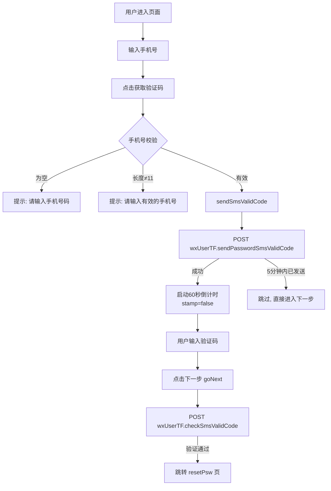

# 忘记密码页（forgetPsw）技术文档

## 1. 页面概述

忘记密码页提供通过手机验证码找回密码的入口。用户输入手机号 → 获取验证码 → 验证通过后跳转到重置密码页。

- **页面路径**：`pages/forgetPsw/forgetPsw`
- **涉及文件**：`forgetPsw.js` / `forgetPsw.wxml` / `forgetPsw.wxss` / `forgetPsw.json`

---

## 2. 数据状态

| 字段 | 类型 | 说明 |
|------|------|------|
| `phone` | String | 输入的手机号 |
| `stamp` | Boolean | 验证码发送冷却标记（`true`=可发送） |
| `msg` | String | 验证码按钮文字（"获取验证码" / 倒计时秒数） |
| `smsValidCode` | String | 用户输入的验证码 |
| `miao` | Number | 倒计时秒数（初始 60） |

---

## 3. 页面交互流程

---

## 4. 核心方法

### 4.1 getCode - 获取验证码

1. 校验手机号是否为空
2. 校验手机号长度是否为 11 位
3. 调用 `sendSmsValidCode()` 发送短信

### 4.2 sendSmsValidCode - 发送短信验证码

**接口**：`wxUserTF.sendPasswordSmsValidCode`

**参数**：`{billId: phone, programType: 2}`

**成功后**：
- `stamp` 设为 `false`（禁止重复发送）
- 启动 `setInterval` 每秒递减 `miao`（从 60 → 0）
- `miao == 0` 时恢复 `stamp=true`，`msg="获取验证码"`

**失败处理**：若返回 "短信验证码5分钟内有效，无需重复申请"，不做额外提示。

### 4.3 goNext - 验证码校验

**接口**：`wxUserTF.checkSmsValidCode`

**参数**：`{billId: phone, smsVaildCode}`

**通过后**：跳转 `/pages/resetPsw/resetPsw`，携带 `billId` 和 `smsVaildCode` 参数。

### 4.4 reback - 返回

`wx.navigateBack()` 返回上一页。

---

## 5. API 接口

| 接口 Bean | 方法 | 参数 | 说明 |
|-----------|------|------|------|
| `wxUserTF` | `sendPasswordSmsValidCode` | `billId, programType:2` | 发送密码重置短信验证码 |
| `wxUserTF` | `checkSmsValidCode` | `billId, smsVaildCode` | 校验短信验证码 |

---

## 6. 页面路由

| 来源 | 目标 | 说明 |
|------|------|------|
| 登录页 | `/pages/forgetPsw/forgetPsw` | 点击"忘记密码？" |
| 本页 | `/pages/resetPsw/resetPsw` | 验证通过后跳转，携带 `billId` + `smsVaildCode` |
