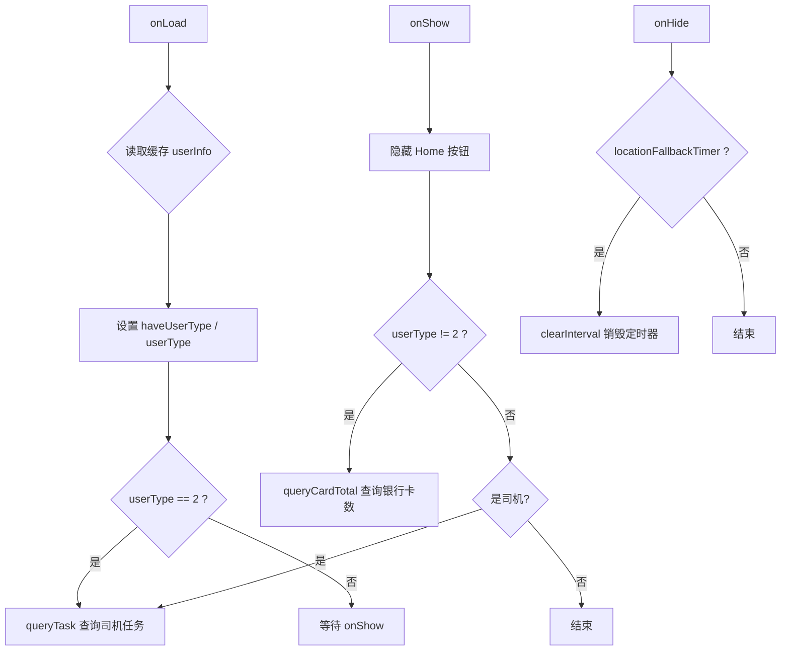
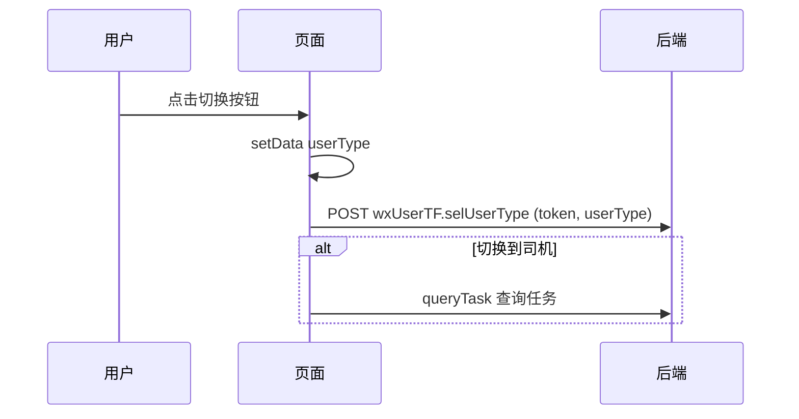
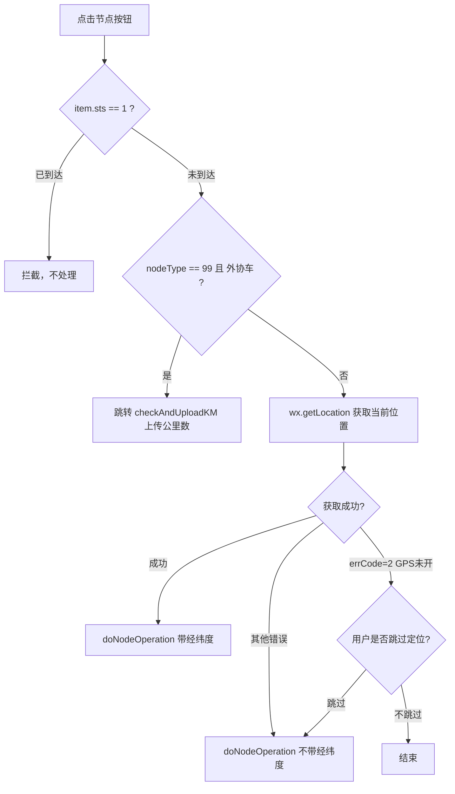
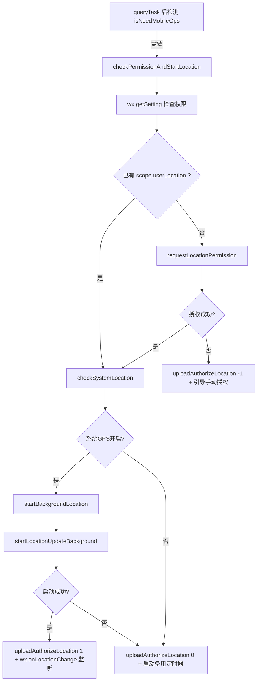
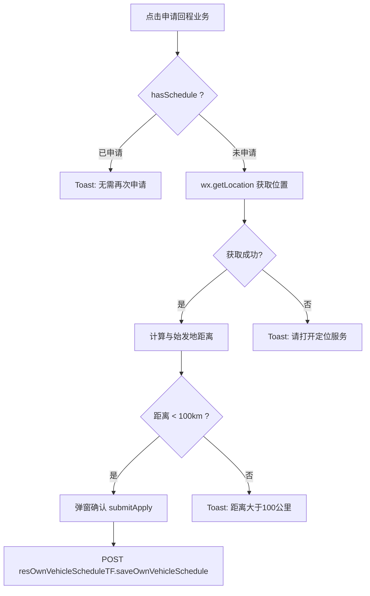
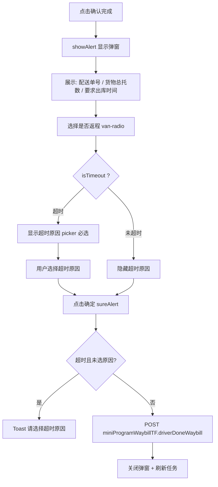
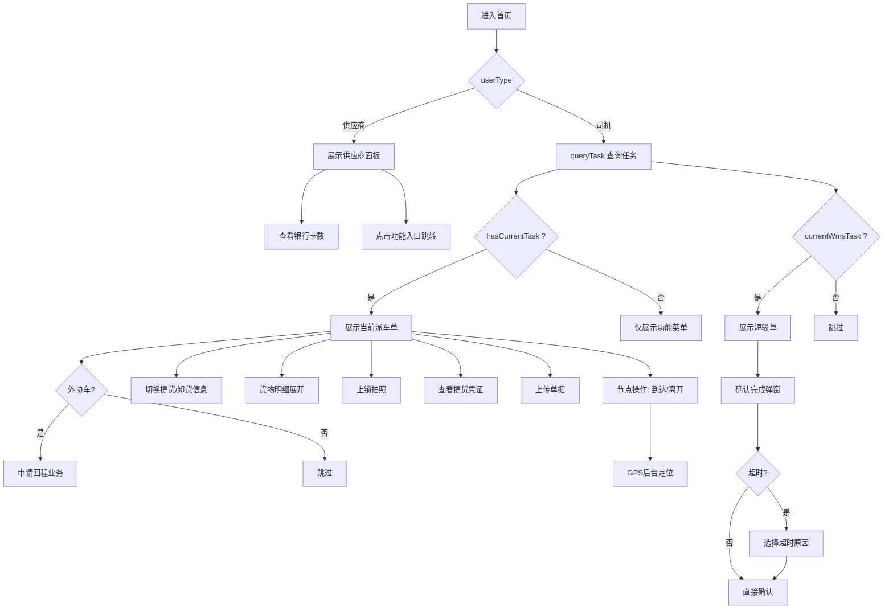

# 首页（index）页面技术文档

## 1. 页面概述

首页是 `eteSupplier` 小程序的核心入口页面，支持**供应商**和**司机**两种角色的双模展示。部分用户同时拥有两种身份（`haveUserType=3`），可在页面顶部自由切换。

- **页面路径**：`pages/index/index`
- **页面名称**：首页
- **涉及文件**：`index.js` / `index.wxml` / `index.wxss` / `index.json`
- **自定义组件**：`alert` 弹窗组件 (`/common/components/alert/alert`)
- **WXS 工具**：`format.wxs`（格式化数字、空值显示等）

---

## 2. 数据状态（data 字段说明）

| 字段 | 类型 | 说明 |
|------|------|------|
| `userType` | Number | 当前展示的用户类型：`1`=供应商，`2`=司机 |
| `haveUserType` | Number | 用户拥有的身份：`1`=仅供应商，`2`=仅司机，`3`=双重身份 |
| `userInfo` | Object | 用户信息对象（含 `tenantName`/`userName`/`billId`/`tokenId`/`isOwn` 等） |
| `info` | Object | 司机任务数据（由 `homeStatisticsData` 接口返回） |
| `cardTotal` | Number | 供应商绑定的银行卡数量 |
| `isPickupGoodsList` | Boolean | 货物信息 Tab 开关：`true`=提货信息，`false`=卸货信息 |
| `isshowGoodsDetail` | Boolean | 是否展开货物明细列表 |
| `goodsList` | Array | 当前显示的货物列表（提货/卸货） |
| `isshowAlert` | Boolean | 短驳单确认完成弹窗是否显示 |
| `isTimeout` | Boolean | 短驳单是否已超时 |
| `timeoutReasonList` | Array | 超时原因列表（`TIMEOUT_REASON4` 字典数据） |
| `timeoutReason` | String | 选中的超时原因 codeValue |
| `timeoutReasonIndex` | Number | 选中的超时原因索引 |
| `mileage` | String | 短驳单返程公里数输入 |
| `lastSaveTime` | Number | 上一次保存 GPS 位置的时间戳（用于限频） |
| `locationFallbackTimer` | Number | 后台定位失败后的备用轮询定时器 ID |
| `location` | Object | 当前上报的定位信息 |

---

## 3. 生命周期流程

### 3.1 onLoad

1. 从 `wx.getStorageSync('userInfo')` 读取用户信息
2. 设置 `haveUserType`、`userInfo`、`token`
3. 若非双重身份（`haveUserType != 3`），直接用该身份作为默认展示
4. 若当前为司机身份，立即调用 `queryTask()` 查询任务

### 3.2 onShow

1. `wx.hideHomeButton()` 隐藏小程序 Home 按钮
2. 供应商身份：调用 `queryCardTotal()` 查询银行卡数量
3. 司机身份：调用 `queryTask()` 刷新任务数据

### 3.3 onHide

- 销毁备用定位轮询定时器 `locationFallbackTimer`，避免后台空转

---

## 4. 功能模块详解

### 4.1 用户角色切换

**触发**：点击顶部 "供应商"/"司机" 切换按钮

**流程**：

**关键逻辑**：
- 仅当 `haveUserType == 3` 时显示两个切换按钮
- 切换后调用后端接口持久化用户类型选择
- 切换到司机时自动触发任务查询

### 4.2 供应商首页功能

**展示区域**：
- **头部信息卡**：供应商名称（`tenantName`）、账单号（`billId`）
- **财务入口**：银行卡数量，点击跳转银行卡管理
- **个人中心**：点击跳转供应商/司机个人中心

**功能导航（9宫格）**：

| 入口 | 跳转路径 | 说明 |
|------|----------|------|
| 运输管理 | `supplier/transport/transportManage/transportManage` | 查看进行中/历史订单 |
| 零担业务 | `supplier/ld/ldManage/ldManage` | 管理零担业务 |
| 司机管理 | `supplier/driver/driverManage/driverManage` | 查看所有司机 |
| 车辆管理 | `supplier/vehicle/vehicleManage/vehicleManage` | GPS硬件管理、新增车辆 |
| 运力调度 | `supplier/capacity/capacityManager/capacityManager` | 查看、上报运力 |
| 竞价管理 | `supplier/bid/bidManage/bidManage` | 线路报价、竞价 |
| 我的财富 | Toast 提示 | 功能暂未开放 |
| 作业登记 | `supplier/jobReg/jobRegManage/jobRegManage` | 外包作业登记 |

### 4.3 司机任务查询

**方法**：`queryTask()`

**接口**：`miniProgramDriverTF.homeStatisticsData`

**返回数据结构**（`info` 对象）：

| 字段 | 说明 |
|------|------|
| `hasCurrentTask` | 是否有当前任务（派车单） |
| `currentWmsTask` | 短驳单数据（短驳配送任务） |
| `waybill` | 派车单主信息（线路名、备注等） |
| `workList` | 作业点列表 |
| `currentWork` | 当前作业点（含提/卸货信息、联系人、地址） |
| `lastWorkList` | 最后一个作业点（收车点） |
| `todoTaskCount` | 待办任务数量 |
| `pickupGoodsList` / `deliveryGoodsList` | 提货/卸货货物列表 |
| `pickupCertificateList` | 提货凭证图片列表 |
| `needLockedTakePictures` | 是否需要上锁拍照 |
| `pickupGoodsCountSum`/`WeightSum`/`VolumeSum` | 提货汇总 |
| `deliveryGoodsCountSum`/`WeightSum`/`VolumeSum` | 卸货汇总 |
| `vehicleAttribution` | 车辆归属（`2` 时显示回程申请按钮） |
| `hasSchedule` | 是否已申请回程 |
| `plateNumber` | 车牌号 |

**附加逻辑**：
- 构建 `lastWork`：从 `workList` 最后一个作业点中找 `nodeType == 99`（收车）
- 若当前作业点是卸货类型，默认切换到 "卸货信息" Tab
- 检查是否需要移动 GPS：调用 `resVehicleInfoTF.isNeedMobileGps`，若需要则启动定位

### 4.4 作业节点操作

#### 4.4.1 节点操作入口 `nodeOperation`

#### 4.4.2 执行节点操作 `doNodeOperation`

**参数**：`workNodeId`、`lat`（纬度）、`lng`（经度）

**流程**：
1. 若传入了经纬度，调用 `common.qqMapTransBMap` 将**腾讯地图坐标**转为**百度地图坐标**
2. 调用 `miniProgramDriverTF.opWorkNode` 提交节点操作
3. 刷新任务数据 `queryTask()`
4. 弹出操作成功提示

#### 4.4.3 UI 展示

页面展示两个节点操作按钮：
- **第一个按钮**（到达）：绑定 `info.currentWork.nodeList[0]`，`sts==1` 时按钮变灰
- **第二个按钮**（离开）：绑定 `info.currentWork.nodeList[1]`

### 4.5 GPS 定位追踪

> 仅在司机有当前任务且后台配置需要 GPS 时启用

#### 整体流程

#### 关键方法

| 方法 | 说明 |
|------|------|
| `checkPermissionAndStartLocation()` | 检查权限并启动定位的总入口 |
| `checkSystemLocation()` | 调用 `wx.getLocation` 检测系统 GPS 是否开启 |
| `requestLocationPermission()` | 请求 `scope.userLocation` 授权 |
| `startBackgroundLocation()` | 启动后台定位 `wx.startLocationUpdateBackground` |
| `startLocationListener()` | 监听 `wx.onLocationChange`，坐标转换后上报 |
| `startLocationFallbackTimer()` | 后台定位失败时，启动 30 秒间隔的 `wx.getLocation` 轮询 |
| `stopLocationFallbackTimer()` | 销毁备用定时器 |
| `updateLocation(location)` | 更新位置信息，组装车牌号和时间 |
| `saveLocationToHistory(location)` | 每分钟通过 `resVehicleInfoTF.saveVehicleMobileGps` 保存一次，10 天后自动停止监听 |
| `uploadAuthorizeLocation(sts)` | 上报定位开启状态（`1`=开启/`0`=失败/`-1`=拒绝） |

#### 坐标转换

- **腾讯地图 → 百度地图**：`common.qqMapTransBMap(lng, lat)`（位置上报时使用）
- **百度地图 → 腾讯地图**：`common.bMapTransQQMap(lng, lat)`（导航时使用）

### 4.6 回程业务申请

**触发条件**：`info.waybill.vehicleAttribution == 2`（外协车）时显示按钮

**关键点**：
- 使用 `common.getMapDistance` 计算当前位置与最后一个作业点的距离
- 距离小于 100 公里才允许申请
- 30 秒内防重复点击（`isLocaltionTimer` 锁）

### 4.7 短驳单确认完成

**触发**：司机有短驳单（`info.currentWmsTask`）时显示

#### 确认弹窗

**接口参数**：`waybillId`、`returnNums`、`isReturn`、`timeoutReason`

### 4.8 货物信息切换

**切换逻辑** `changeGoodsTyep()`：
- `isPickupGoodsList` 取反
- `true`：展示 `info.pickupGoodsList`（提货信息）
- `false`：展示 `info.deliveryGoodsList`（卸货信息）
- 汇总数据显示：件数 / 重量(KG) / 体积(m³)

### 4.9 货物明细展开

`showGoodsDetail()`：切换 `isshowGoodsDetail`，展开后显示每件货物的：
- 名称、规格、件数、包装类型
- 重量(kg)、类别、体积(m³)

### 4.10 地图导航

`getLocaltion()`：
1. 从 `info.currentWork` 取经纬度，通过 `bMapTransQQMap` 转为腾讯坐标
2. 调用 `wx.getLocation` 获取当前位置
3. 成功后调用 `wx.openLocation` 打开微信内置地图
4. 失败时若 `errCode == 2`，提示打开 GPS

### 4.11 上锁拍照

`photoLock()`：
1. 获取当前位置（坐标转为百度地图坐标）
2. 调起相机 `wx.chooseImage({sourceType: ['camera']})`
3. 上传图片 `util.uploadFile`
4. 调用 `miniProgramDriverTF.lockUpload` 提交（含图片ID、路径、经纬度）

### 4.12 提货凭证查看

`seePickupImg()`：遍历 `info.pickupCertificateList`，使用 `wx.previewImage` 全屏预览。

### 4.13 扫码查询

`doScan()`：
1. 调起 `wx.scanCode({onlyFromCamera: true})` 扫码
2. 将扫码结果作为 `waybillId`，跳转到派车单详情页

### 4.14 司机功能导航

| 入口 | 跳转路径 | 说明 |
|------|----------|------|
| 待办任务 | `driver/task/todoTasks/todoTasks` | 所有未运作的订单（红点显示数量） |
| 订单包业务 | `driver/orderPackage/orderList/orderList` | 领取订单包任务 |
| 历史任务 | `driver/task/historyTasks/historyTasks` | 运作完成的订单记录 |
| 点检管理 | `driver/vehicleCheck/vehicleCheckManage/vehicleCheckManage` | 查看修改车辆点检 |
| 车辆变动成本 | `driver/costCapacity/costCapacityList/costCapacityList` | 仅 `isOwn==1` 可见 |
| 车辆修理成本 | `driver/vehicleRepairCost/vehicleRepairCostList/vehicleRepairCostList` | 仅 `isOwn==1` 可见 |
| 标签扫码查询 | 本页扫码 | 扫描回单标签查看详情 |

---

## 5. API 接口清单

| 接口 Bean | 方法 | 参数 | 说明 | 调用时机 |
|-----------|------|------|------|----------|
| `wxUserTF` | `selUserType` | `token, userType` | 持久化用户类型选择 | 切换角色时 |
| `bankTF` | `queryBankInfoCount` | — | 查询银行卡数量 | 供应商 onShow |
| `miniProgramDriverTF` | `homeStatisticsData` | — | 司机首页任务统计数据 | 司机 onLoad/onShow/切换角色 |
| `miniProgramDriverTF` | `opWorkNode` | `workNodeId, latitude, longitude` | 执行作业节点操作 | 点击到达/离开按钮 |
| `miniProgramDriverTF` | `lockUpload` | `waybillId, currentWaybillWorkId, imgId, imgPath, lat, lng` | 上锁拍照上传 | 上锁拍照后 |
| `miniProgramDriverTF` | `uploadWaybillReceipts` | `waybillId, currentWaybillWorkId, receiptsList` | 提交运单单据 | （跳转子页面操作） |
| `resOwnVehicleScheduleTF` | `saveOwnVehicleSchedule` | `waybillId` | 申请回程业务 | 确认回程申请后 |
| `resVehicleInfoTF` | `isNeedMobileGps` | — | 检查是否需要移动GPS | 有当前任务时 |
| `resVehicleInfoTF` | `saveVehicleMobileGps` | `plateNumber, latitude, longitude, accuracy, speed, altitude, gpsTime` | 保存GPS位置历史 | 每分钟一次 |
| `driverTF` | `isOpenLocation` | `userId, isOpenLocation` | 上报定位开启状态 | 定位启动/失败/拒绝时 |
| `miniProgramWaybillTF` | `isTimeout` | `waybillId` | 检查短驳单是否超时 | queryTask 中有短驳单时 |
| `miniProgramWaybillTF` | `driverDoneWaybill` | `waybillId, returnNums, isReturn, timeoutReason` | 司机确认完成短驳单 | 确认完成弹窗确定 |
| `commonTF` | `getSysStaticDataByCodeTypes` | `codeType: "TIMEOUT_REASON4"` | 获取超时原因字典 | 短驳单超时时 |

---

## 6. 页面路由跳转表

| 来源 | 目标路径 | 传参 |
|------|----------|------|
| 供应商-运输管理 | `/supplier/transport/transportManage/transportManage` | — |
| 供应商-零担业务 | `/supplier/ld/ldManage/ldManage` | — |
| 供应商-司机管理 | `/supplier/driver/driverManage/driverManage` | — |
| 供应商-车辆管理 | `/supplier/vehicle/vehicleManage/vehicleManage` | — |
| 供应商-运力调度 | `/supplier/capacity/capacityManager/capacityManager` | — |
| 供应商-竞价管理 | `/supplier/bid/bidManage/bidManage` | — |
| 供应商-作业登记 | `/supplier/jobReg/jobRegManage/jobRegManage` | — |
| 供应商-银行卡 | `/supplier/personal/bankcards/bankcards` | — |
| 供应商-个人中心 | `/supplier/personal/personal/personal` | — |
| 司机-个人中心 | `/driver/personal/personal/personal` | — |
| 司机-调整顺序 | `/driver/task/waySort/waySort` | `info`(workList JSON), `waybillId` |
| 司机-上传公里数 | `/driver/task/checkAndUploadKM/checkAndUploadKM` | `waybillId`, `workNodeId`, `type=3` |
| 司机-上传单据 | `/driver/task/uploadTicket/uploadTicket` | `waybillId` |
| 司机-派车单详情 | `/driver/task/truckingDetail/truckingDetail` | `waybillId` |
| 司机-短驳单详情 | `/driver/task/shortBarge/shortBarge` | `waybillId`(currentWmsTask.id) |
| 司机-待办任务 | `/driver/task/todoTasks/todoTasks` | — |
| 司机-订单包业务 | `/driver/orderPackage/orderList/orderList` | — |
| 司机-历史任务 | `/driver/task/historyTasks/historyTasks` | — |
| 司机-点检管理 | `/driver/vehicleCheck/vehicleCheckManage/vehicleCheckManage` | — |
| 司机-车辆变动成本 | `/driver/costCapacity/costCapacityList/costCapacityList` | — |
| 司机-车辆修理成本 | `/driver/vehicleRepairCost/vehicleRepairCostList/vehicleRepairCostList` | — |
| 司机-扫码查单 | `/driver/task/truckingDetail/truckingDetail` | `waybillId`（扫码结果） |

---

## 7. 关键交互流程图

### 7.1 司机首页完整交互

---

## 8. 注意事项

1. **坐标系统混用**：页面中涉及腾讯地图（QQMap）和百度地图（BMap）两套坐标体系，需要在前端进行转换。导航用腾讯坐标，数据上报用百度坐标。

2. **GPS 资源管理**：
   - 后台定位 `wx.startLocationUpdateBackground` 失败时，会自动启动 30 秒间隔的 `getLocation` 轮询作为备用方案
   - 页面 `onHide` 时必须销毁定时器
   - 定位监听满 10 天自动退出（`wx.offLocationChange`）

3. **防抖/节流**：
   - 回程申请：30 秒防重复点击
   - GPS 保存：每分钟保存一次

4. **权限处理**：
   - 定位权限分层检查：先检查小程序授权 → 再检查系统 GPS → 失败则引导用户设置
   - 节点操作时 GPS 失败允许跳过定位继续操作

5. **注释的已废弃代码**：wxml 中存在大量注释掉的历史代码（消息管理入口、器具登记入口、部分节点操作逻辑），这些功能已下线或重构。
