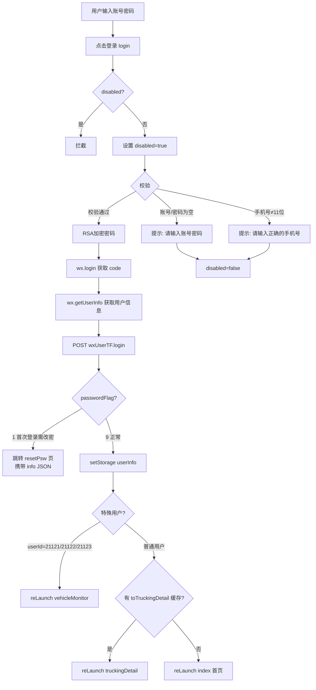

# 登录页（login）技术文档

## 1. 页面概述

登录页是用户身份认证的核心页面。支持账号密码登录，密码经 RSA 加密后传输。登录成功后根据密码状态（首次/过期/正常）和用户身份分流到不同页面。

- **页面路径**：`pages/login/login`
- **涉及文件**：`login.js` / `login.wxml` / `login.wxss` / `login.json`

---

## 2. 数据状态

| 字段 | 类型 | 说明 |
|------|------|------|
| `username` | String | 手机号（账号） |
| `password` | String | 明文密码（提交前加密） |
| `disabled` | Boolean | 防重复提交锁 |

---

## 3. 登录流程

---

## 4. 核心方法

### 4.1 login - 登录主流程

**步骤**：
1. **防重复**：`disabled` 锁防止重复提交
2. **前端校验**：账号不能为空、手机号长度必须为 11 位
3. **密码加密**：`util.rsaEncrypt(password)` RSA 公钥加密
4. **获取凭证**：`wx.login()` 获取临时 code，`wx.getUserInfo()` 获取用户信息
5. **提交登录**：`wxUserTF.login({wxCode, userInfo, billId, password, programType:2})`

### 4.2 passwordFlag 分流逻辑

| passwordFlag | 含义 | 处理 |
|-------------|------|------|
| `1` | 首次登录需修改密码 | `navigateTo resetPsw` 携带 `info`（JSON 编码） |
| `9` | 密码正常 | 存入 `userInfo`，分流到首页或特定页面 |

### 4.3 正常登录后分流

1. **优先检查**：`wx.getStorageSync('toTruckingDetail')`——若有缓存，直接跳转派车单详情（用于外部链接/扫码直接进入的场景）
2. **特殊用户**：`userId` 为 21121/21122/21123 跳转 `vehicleMonitor`（车辆监控页）
3. **普通用户**：跳转 `/pages/index/index` 首页

### 4.4 其他导航

| 方法 | 目标 |
|------|------|
| `toForgetPsw()` | `/pages/forgetPsw/forgetPsw` |
| `protocol()` | `/pages/protocol/protocol` |
| `toRegisterDriver()` | `/pages/registerDriver/registerDriver` |

---

## 5. API 接口

| 接口 Bean | 方法 | 参数 | 说明 |
|-----------|------|------|------|
| `wxUserTF` | `login` | `wxCode, userInfo, billId, password(RSA), programType:2` | 账号密码登录 |

---

## 6. 页面路由

| 来源 | 目标 | 方式 |
|------|------|------|
| guideIndex | 本页 | `reLaunch` |
| 本页 → 忘记密码 | `forgetPsw` | `navigateTo` |
| 本页 → 用户协议 | `protocol` | `navigateTo` |
| 本页 → 司机注册 | `registerDriver` | `navigateTo` |
| 本页 → 首次改密 | `resetPsw` + `info` | `navigateTo` |
| 本页 → 首页 | `index` | `reLaunch` |
| 本页 → 派车单详情 | `truckingDetail` + `waybillId` | `reLaunch` |
| 本页 → 车辆监控 | `vehicleMonitor` | `reLaunch` |

---

## 7. 注意事项

1. **密码安全**：密码在前端经 `rsaEncrypt` 加密后传输，不传输明文
2. **disabled 锁**：防止用户快速点击导致多次提交，异常时会在 `catch` 中释放锁
3. **toTruckingDetail 缓存**：用于外部扫码或链接直接打开派车单详情时，先要求登录再跳转回目标页面
4. **用户协议已隐藏**：WXML 中的用户协议勾选框被注释，目前无需勾选协议即可登录
