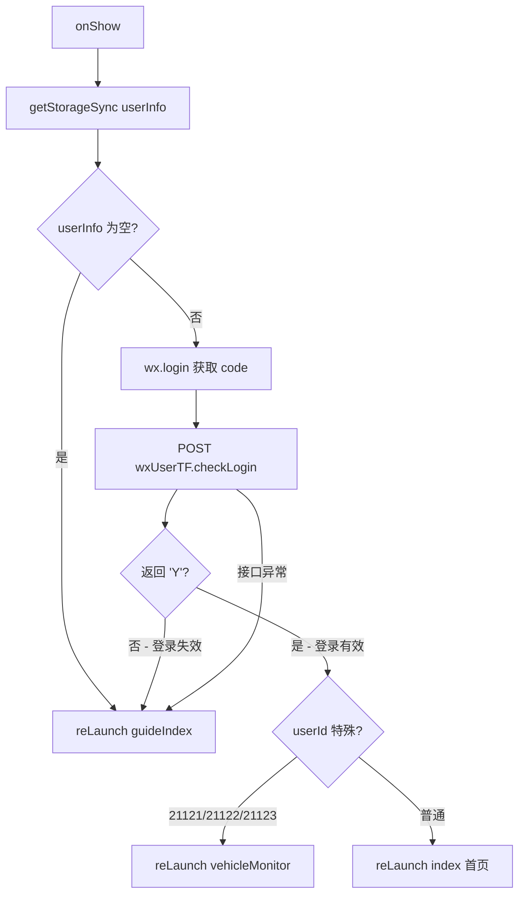

# 会话保持页（preserve）技术文档

## 1. 页面概述

preserve 页是一个**隐式会话检查页**，不展示任何 UI（WXML 为空）。用于小程序启动时检查登录态是否有效，决定是进入首页还是重新登录。

- **页面路径**：`pages/preserve/preserve`
- **涉及文件**：`preserve.js` / `preserve.wxml`（空文件） / `preserve.wxss` / `preserve.json`

---

## 2. 数据状态

无自定义数据字段。

---

## 3. 生命周期

### 3.1 onLoad

```
onLoad() → wx.removeStorageSync('toTruckingDetail')
```

清除 `toTruckingDetail` 缓存（外部跳转目标标记），确保本次启动不受旧缓存影响。

### 3.2 onShow - 登录态检查



**关键逻辑**：
1. 先从 Storage 读取 `userInfo`，为空则直接跳引导页
2. 有 `userInfo` 时，调用 `wx.login()` 获取最新 code
3. 通过 `wxUserTF.checkLogin` 接口验证登录态有效性
4. 验证通过 → 分流首页（同登录页的分流逻辑）
5. 验证失败/异常 → 跳转引导页重新登录

---

## 4. API 接口

| 接口 Bean | 方法 | 参数 | 说明 |
|-----------|------|------|------|
| `wxUserTF` | `checkLogin` | `wxCode, programType:2` | 检查登录态是否有效 |

---

## 5. 页面路由

| 来源 | 目标 | 方式 |
|------|------|------|
| app 启动 | 本页 | 配置入口 |
| 本页 → 登录有效 | `index` 或 `vehicleMonitor` | `reLaunch` |
| 本页 → 登录失效 | `guideIndex` | `reLaunch` |

---

## 6. 注意事项

1. **无 UI 页面**：`preserve.wxml` 为空文件，用户看不到此页面
2. **启动入口**：推测 `app.json` 中 `pages` 数组的首项是本页，作为小程序启动的第一个页面
3. **静默验证**：每次 `onShow` 都会调 `wx.login()` 和 `checkLogin` 验证，确保登录态实时有效
