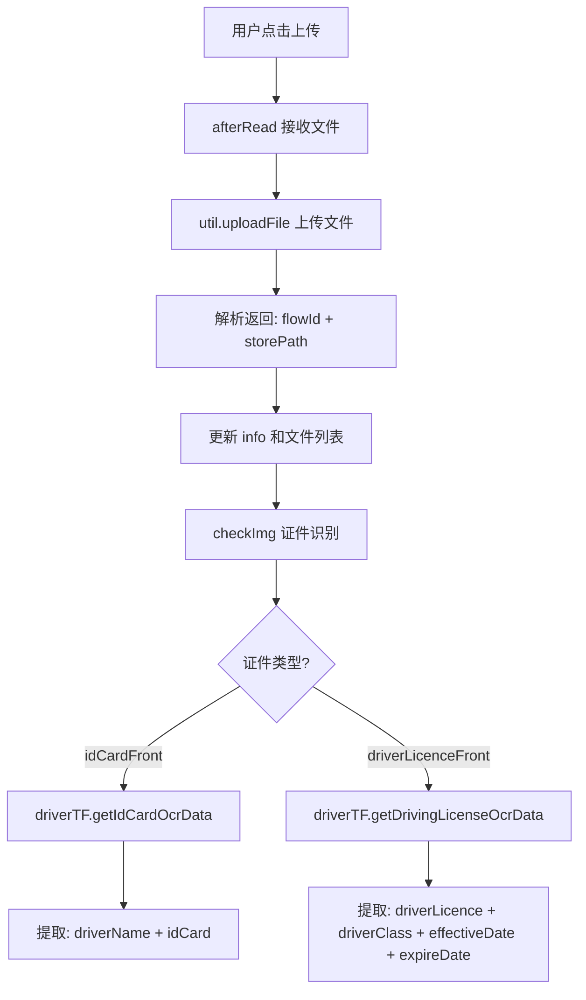

# 司机注册页（registerDriver）技术文档

## 1. 页面概述

司机注册页用于新司机自助注册。用户上传身份证、驾驶证、从业资格证照片，系统自动 OCR 识别关键信息填充表单，提交后完成注册。

- **页面路径**：`pages/registerDriver/registerDriver`
- **涉及文件**：`registerDriver.js` / `registerDriver.wxml` / `registerDriver.wxss` / `registerDriver.json`

---

## 2. 数据状态

| 字段 | 类型 | 说明 |
|------|------|------|
| `info` | Object | 司机注册信息对象（含所有表单字段） |
| `info.individualSupplier` | String | 是否个体司机（`0`/`1`，已注释不使用） |
| `isShowSupplierPopover` | Boolean | 供应商选择弹窗是否显示 |
| `supplierInfo` | Object | 供应商查询条件（`supplierName`, `rows:20`） |
| `page` | Number | 供应商列表当前页码 |
| `supplierList` | Array | 供应商列表数据 |
| `hasNext` | Boolean | 供应商列表是否有下一页 |
| `idCardFrontList` | Array | 身份证正面文件列表 |
| `idCardBackList` | Array | 身份证反面文件列表 |
| `driverLicenceFrontList` | Array | 驾驶证正面文件列表 |
| `driverLicenceBackList` | Array | 驾驶证反面文件列表 |
| `qualifyCertList` | Array | 从业资格证文件列表 |

---

## 3. 证件上传与 OCR 识别

### 3.1 afterRead - 文件上传回调

1. 接收 `van-uploader` 的 `after-read` 事件
2. 通过 `data-id` 区分上传的文件类型
3. `util.uploadFile(file)` 上传到服务器
4. 解析返回数据，提取 `flowId`（文件ID）、`storePath`（存储路径）、`fullPath`（完整访问路径）
5. 存储到 `info[id+'Img']`、`info[id+'ImgPath']`、`[id+'List']`
6. 调用 `checkImg(id)` 进行 OCR 识别

### 3.2 checkImg - OCR 证件识别

| 证件类型 | OCR 接口 | 提取字段 |
|----------|----------|----------|
| `idCardFront`（身份证正面） | `driverTF.getIdCardOcrData` | `driverName`（姓名）、`idCard`（身份证号） |
| `driverLicenceFront`（驾驶证正面） | `driverTF.getDrivingLicenseOcrData` | `driverLicence`（驾驶证号）、`driverClass`（准驾车型）、`effectiveDate`（有效期开始）、`expireDate`（有效期结束） |

### 3.3 deleteImg - 删除图片

清空对应证件类型的 `fileId`、`filePath`、文件列表。

---

## 4. 表单字段

| 字段 key | 标签 | 输入方式 | 来源 |
|----------|------|----------|------|
| `driverName` | 司机姓名 | 手动输入 / OCR 自动填充 | 身份证 OCR |
| `driverPhone` | 手机号 | 手动输入 | 用户填写 |
| `idCard` | 身份证号 | 手动输入 / OCR 自动填充 | 身份证 OCR |
| `driverLicence` | 驾驶证号 | 手动输入 / OCR 自动填充 | 驾驶证 OCR |
| `driverClass` | 准驾车型 | 手动输入 / OCR 自动填充 | 驾驶证 OCR |
| `licenseIssuingAuthority` | 发证机关 | 手动输入 | 用户填写 |
| `qualifyCertId` | 从业资格证号 | 手动输入 | 用户填写 |
| `effectiveDate` | 有效期开始 | 日期选择器 / OCR | 驾驶证 OCR |
| `expireDate` | 有效期结束 | 日期选择器 / OCR | 驾驶证 OCR |

---

## 5. 供应商选择（已注释）

原设计中司机可选择归属供应商，但当前代码已将相关 UI 和逻辑注释：

- `individualSupplier` 单选（个体司机 是/否）
- `showSupplierPopover` 供应商搜索选择弹窗
- `querySupplierList` / `searchSupplierList` / `selectSupplier` 等方法保留但未启用

这些方法和数据虽然被 UI 注释隐藏，但 JS 逻辑仍保留在代码中。

---

## 6. 提交注册

### 6.1 submit

**接口**：`driverTF.registerDriver`

**参数**：`this.data.info`（完整注册信息对象）

**成功后**：
- 弹出 "司机注册成功" 提示
- `wx.navigateBack()` 返回上一页

---

## 7. API 接口

| 接口 Bean | 方法 | 参数 | 说明 |
|-----------|------|------|------|
| `driverTF` | `getIdCardOcrData` | `fileId`（身份证图片ID） | OCR 识别身份证信息 |
| `driverTF` | `getDrivingLicenseOcrData` | `fileId`（驾驶证图片ID） | OCR 识别驾驶证信息 |
| `driverTF` | `registerDriver` | `info`（完整注册信息） | 提交司机注册 |
| `supplierTF` | `querySupplierList` | `supplierName, page, rows` | 查询供应商列表（已注释未使用） |

---

## 8. 页面路由

| 来源 | 目标 | 说明 |
|------|------|------|
| 登录页 | `/pages/registerDriver/registerDriver` | 点击"司机注册"按钮 |
| 本页 | `wx.navigateBack` | 注册成功后返回上一页 |

---

## 9. 注意事项

1. **供应商功能已注释**：个体司机/供应商关联的选择功能已被注释，当前司机注册不关联供应商
2. **OCR 识别依赖**：身份证号和驾驶证号严重依赖 OCR 识别准确性，手动修改可能覆盖 OCR 结果
3. **图片上传无大小限制**：未对上传图片做尺寸/格式限制
4. **注册无重复校验**：未在前端对手机号、身份证号做重复注册校验（依赖后端）
5. **数据绑定方式**：使用 `this.data.info[key] = value` 直接修改 data 对象而非 setData 逐字段更新，可能存在数据不一致风险
