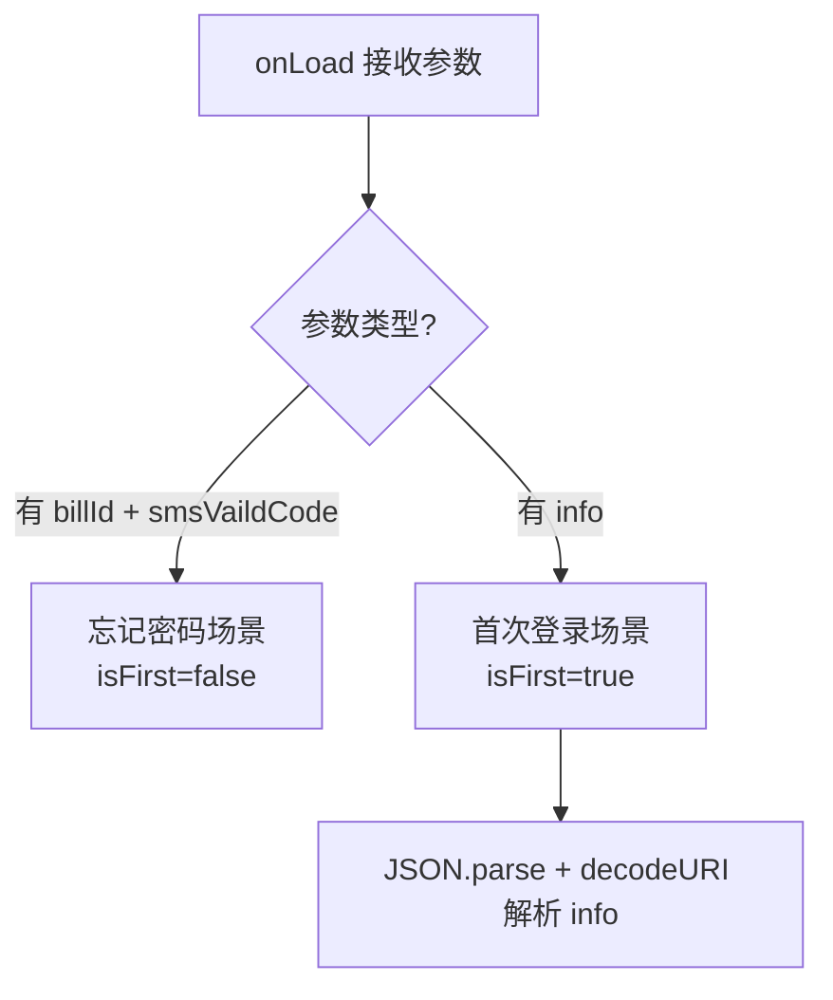
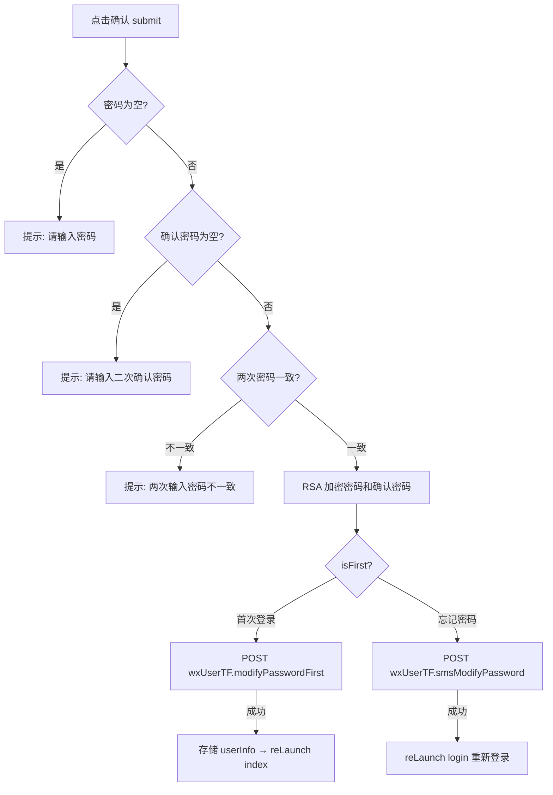

# 重置密码页（resetPsw）技术文档

## 1. 页面概述

重置密码页支持两种场景：**忘记密码后重置**（通过短信验证码）和**首次登录强制改密**。用户输入新密码并二次确认后提交，密码经 RSA 加密后传输。

- **页面路径**：`pages/resetPsw/resetPsw`
- **涉及文件**：`resetPsw.js` / `resetPsw.wxml` / `resetPsw.wxss` / `resetPsw.json`

---

## 2. 数据状态

| 字段 | 类型 | 说明 |
|------|------|------|
| `billId` | String | 手机号/账号（忘记密码场景） |
| `smsVaildCode` | String | 短信验证码（忘记密码场景） |
| `password` | String | 新密码（明文） |
| `confirmPassword` | String | 确认密码（明文） |
| `isFirst` | Boolean | `true`=首次登录改密 / `false`=忘记密码重置 |
| `info` | Object | 首次登录时的用户完整信息（含 billId 等） |

---

## 3. 页面入口识别

### 3.1 场景一：忘记密码重置

**入参**：`billId`（手机号）、`smsVaildCode`（已验证通过的短信验证码）

**来源**：`forgetPsw` 页验证通过后跳转

**提交接口**：`wxUserTF.smsModifyPassword`

### 3.2 场景二：首次登录强制改密

**入参**：`info`（JSON 编码的用户登录信息）

**来源**：`login` 页 `passwordFlag==1` 时跳转

**提交接口**：`wxUserTF.modifyPasswordFirst`

---

## 4. 提交流程

---

## 5. 核心方法

### 5.1 submit - 提交改密

**参数构建**：

| 参数 | 首次登录 | 忘记密码 |
|------|----------|----------|
| `billId` | `info.billId` | 入参 `billId` |
| `smsVaildCode` | 无 | 入参 `smsVaildCode` |
| `password` | RSA 加密 | RSA 加密 |
| `confirmPassword` | RSA 加密 | RSA 加密 |

**成功后**：
- 首次改密：`setStorage('userInfo', info)` → `reLaunch index`
- 忘记密码：`reLaunch login`（需重新登录）

### 5.2 inputSetData - 输入绑定

通用的输入框数据绑定，通过 `data-key` 区分字段。

### 5.3 clearData - 清空输入

通过 `data-key` 清空指定输入框。

---

## 6. API 接口

| 接口 Bean | 方法 | 参数 | 说明 |
|-----------|------|------|------|
| `wxUserTF` | `modifyPasswordFirst` | `billId, password(RSA), confirmPassword(RSA)` | 首次登录修改密码 |
| `wxUserTF` | `smsModifyPassword` | `billId, smsVaildCode, password(RSA), confirmPassword(RSA)` | 短信验证码修改密码 |

---

## 7. 页面路由

| 来源 | 目标 | 方式 |
|------|------|------|
| login（首次改密） | 本页 + `info` | `navigateTo` |
| forgetPsw（忘记密码） | 本页 + `billId` + `smsVaildCode` | `navigateTo` |
| 本页 → 首次改密成功 | `index` | `reLaunch` |
| 本页 → 忘记密码成功 | `login` | `reLaunch` |

---

## 8. 注意事项

1. **密码安全**：密码在前端使用 `util.rsaEncrypt` 加密后传输
2. **密码规则提示**：WXML 中显示 "密码长度8~32位，须包含数字、字母、符号至少两种或以上元素"，但前端代码未强制校验该规则（依赖后端验证）
3. **首次改密**：成功后直接存储 `userInfo` 并进入首页，无需重新登录
4. **忘记密码**：改密成功后跳回登录页，需要用户重新输入密码登录
